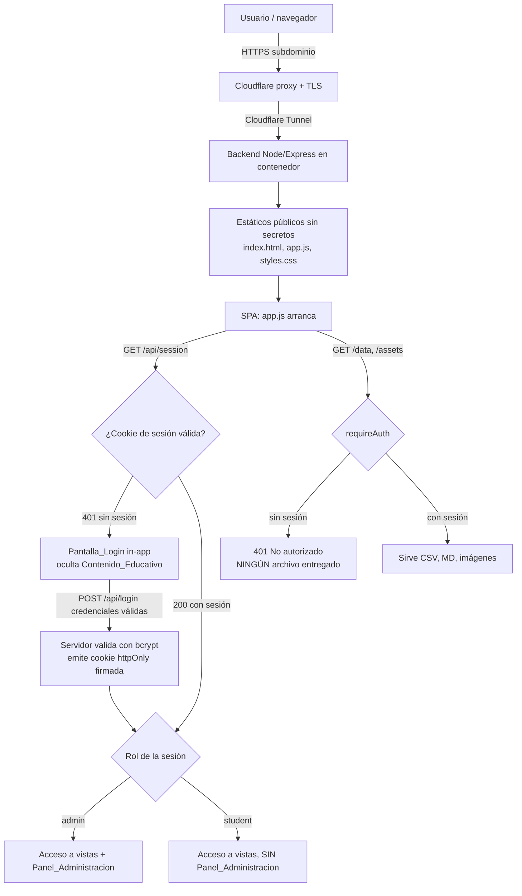
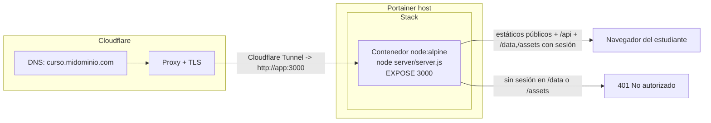
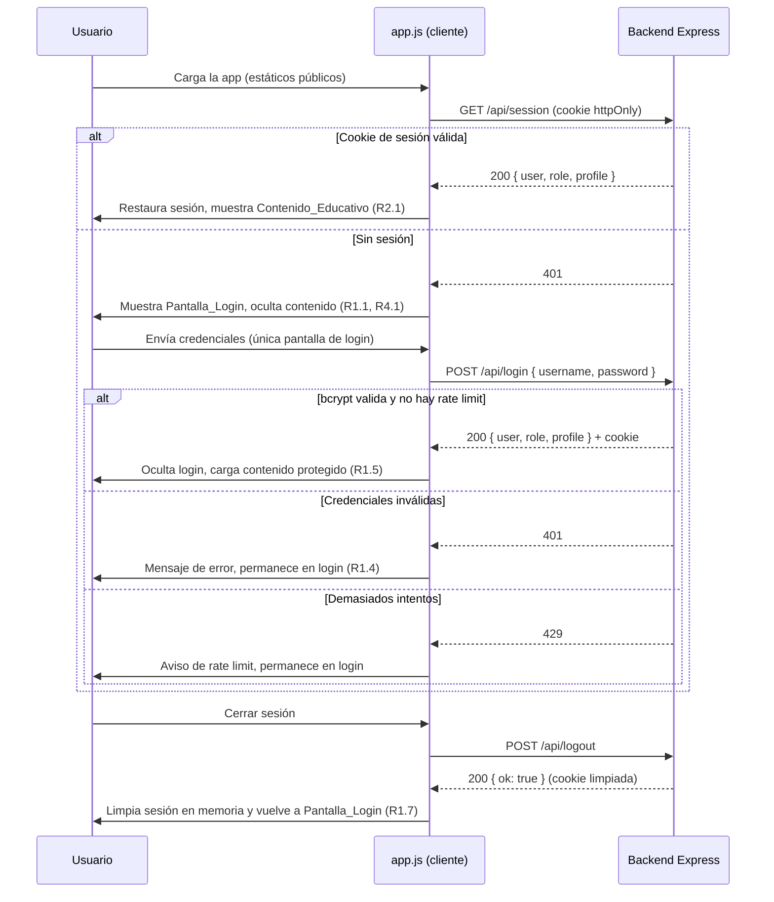

# Documento de Diseño

## Overview

Este diseño evoluciona "Ivania Facial Lab" —una SPA de vanilla JS— en cuatro frentes
interdependientes, **sin introducir ningún framework de frontend** y manteniendo el enfoque actual
de la SPA (carga de CSV/Markdown vía `fetch`, estado de progreso en `localStorage`, dependencias por
CDN cargadas de forma diferida):

1. **Autenticación y roles reales con un backend propio.** Un servidor Node/Express valida las
   credenciales con `bcrypt`, emite una **cookie de sesión httpOnly firmada** y **no entrega el
   contenido** (`/data`, `/assets`) sin sesión válida. La SPA ya no contiene secretos: usa una única
   pantalla de login propia que habla con el backend, restaura la sesión consultando al servidor y
   aplica un gate de administración basado en el rol de la sesión.
2. **Empaquetado y despliegue** en un contenedor `node:alpine` que ejecuta el backend, orquestado por
   un stack importable en Portainer y expuesto en un subdominio de Cloudflare vía Cloudflare Tunnel.
3. **Responsive móvil** rediseñando el sidebar como *drawer* superpuesto accionado por el botón ☰
   existente, recuperando el acceso a "Empezar sesión" y la actividad reciente en móvil, y cargando
   Leaflet y Swiper de forma diferida (lazy load dinámico) solo al entrar a sus vistas.
4. **Eliminación del estado vacío** en Quizzes y Flashcards, defaulteando a la semana actual y
   permitiendo seleccionar semana desde la propia vista.

### Decisión clave de arquitectura de acceso

La aplicación servía contenido estático: cualquier lógica de autenticación que viva **solo en el
cliente es evadible** (basta con pedir los CSV/MD directamente o saltarse la pantalla de login en
JS). El usuario quiere **una sola pantalla de login —la de la app— y que sea realmente segura**. Un
login solo-cliente sobre archivos estáticos no protege el contenido, por lo que se introdujo un
**backend Node/Express** que pasa a ser la **única capa de autenticación**:

- **El backend protege el contenido y gestiona la sesión** — Requirements R1, R2, R4, R8.
  El servidor valida credenciales con `bcrypt`, emite la cookie de sesión y **deniega `/data` y
  `/assets` sin sesión válida** (guard `requireAuth`). Esto hace el contenido genuinamente
  semiprivado a nivel de servidor.
- **La SPA gestiona experiencia de sesión y rol** — Requirements R1 (UI), R3, R5.
  Muestra la pantalla de login, refleja el perfil/rol activo y autoriza el panel de administración
  por rol. La validación de credenciales y la sesión **ya no viven en el cliente**.

Ya **no hay doble cortina**: una sola capa (el backend) cubre tanto la protección del contenido como
la sesión/rol. La sección *Architecture* detalla los diagramas.

### Historial de decisión

El diseño anterior recomendaba la **Opción B — Basic Auth en nginx** como barrera de contenido,
combinada con un login *cosmético* dentro de la SPA. Se descartó por dos razones del usuario:

- **Una sola pantalla de login.** Basic Auth muestra el prompt nativo del navegador (feo, no
  estilizable, logout incómodo) *además* del login de la app: dos cortinas para el usuario.
- **Seguridad real con la pantalla propia de la app.** Se quería que el login bonito de la SPA fuese
  la barrera real, no una capa cosmética sobre archivos públicos.

Por eso se eligió la que antes se llamaba **Opción C — backend propio**: un servidor Node/Express con
login seguro (bcrypt + cookie httpOnly) que sirve la SPA y protege el contenido. Esto unifica borde y
aplicación en una sola capa, da control total de la UX de login y logout limpio, y elimina la
necesidad de nginx, `.htpasswd` y la página `50x.html` de nginx.

### Resumen de cambios de superficie

| Área | Archivos tocados | Naturaleza |
|------|------------------|------------|
| Backend de auth | `server/server.js`, `server/package.json` | Servidor Express nuevo (login, sesión, guard de contenido) |
| Auth/sesión/rol en SPA | `App/app.js`, `App/index.html`, `App/styles.css` | El cliente consume el backend; se eliminan secretos y lógica de credenciales |
| Responsive drawer | `App/styles.css`, `App/app.js` | CSS de media query + handlers del ☰ |
| Empezar sesión / actividad móvil | `App/app.js`, `App/styles.css` | Render condicional en el flujo de contenido |
| Lazy load Leaflet/Swiper | `App/index.html`, `App/app.js` | Quitar `<script>`/`<link>` del head; loader dinámico |
| Default semana Quizzes/Flashcards | `App/app.js` | Resolución de semana + selector embebido |
| Despliegue | `Dockerfile`, `docker-compose.yml`, `.dockerignore`, `deploy/README.md` | Contenedor Node; se elimina nginx |

## Architecture

### Arquitectura de acceso elegida — backend Node/Express

El servidor (`server/server.js`, CommonJS) es la **única capa de autenticación**. Como el
`package.json` raíz declara `"type": "module"`, se añade `server/package.json` con
`{ "type": "commonjs" }` para que el servidor use `require`/`module.exports`.

**Validación de credenciales (bcrypt).** Usuarios: `ivi` (role `student`, profile `ivi`), `xime`
(role `student`, profile `xime`), `admin` (role `admin`, profile `admin`). Cada usuario tiene un hash
`bcrypt` (`bcryptjs`), sobreescribible por las variables de entorno `HASH_IVI` / `HASH_XIME` /
`HASH_ADMIN`. `bcrypt.compare` se ejecuta **siempre** (contra un hash *dummy* si el usuario no
existe) para no filtrar por *timing* si una cuenta existe o no.

**Sesión (cookie httpOnly firmada, stateless).** Se usa `cookie-session` (nombre `ivania_sess`,
`httpOnly`, `sameSite: lax`, `secure = COOKIE_SECURE`, `maxAge` 30 días, `secret = SESSION_SECRET`).
No hay store de sesiones en memoria: la cookie firmada transporta `{ user, role, profile }`.

**Rate limiting.** Contador en memoria por IP en `POST /api/login`: 10 fallos en 15 minutos → `429`.

**Guard de contenido (`requireAuth`).** Aplicado a `/data` y `/assets` (`express.static`): sin sesión
válida → `401`. Los estáticos **públicos** (`index.html`, `app.js`, `styles.css`, favicon) se sirven
sin sesión, pero **ya no contienen secretos**. Fallback SPA con `app.get(/.*/)` (Express 5 /
path-to-regexp v8 no admite el comodín `"*"`).

#### Endpoints del backend

| Método y ruta | Cuerpo | Respuesta |
|---------------|--------|-----------|
| `POST /api/login` | `{ username, password }` | `200 { user, role, profile }` · `401` credenciales inválidas · `429` rate limit |
| `POST /api/logout` | — | `200 { ok: true }` |
| `GET /api/session` | — | `200 { user, role, profile }` · `401` sin sesión |
| `GET /data/**`, `/assets/**` | — | `200` con sesión · `401` sin sesión (guard `requireAuth`) |
| Estáticos públicos + fallback SPA | — | `200` sin requerir sesión |

### Relación entre el backend y la sesión/rol de la app (R3, R4, R8)



Lectura de la relación:

- **El guard `requireAuth` del backend (R4.1, R4.3, R8.1, R8.2)** es la barrera real: sin cookie de
  sesión válida no se descarga ningún recurso de `/data` ni `/assets`. Es la **única** capa de
  seguridad del contenido.
- **La pantalla de login de la SPA (R1, R5)** es la capa de **experiencia**: una sola pantalla,
  propia de la app, que envía credenciales al backend y refleja el perfil/rol de la sesión devuelta.
- **El gate de administración (R3)** vive en la SPA y se basa en el **rol de la sesión** (devuelto por
  el servidor), no en CSS: el router rechaza la vista `admin` para `student` como control primario y,
  complementariamente, redirige a `home`.
- **R8.3** queda documentado por este diagrama: **una sola capa de autenticación (el backend)** cubre
  tanto la protección del contenido como la sesión/rol de los dos perfiles efectivos
  (`student`/`admin`).

### Arquitectura de despliegue



El contenedor publica `${HOST_PORT:-8080}:3000`. Cloudflare Tunnel (`cloudflared` en la misma red)
apunta a `http://app:3000`. Variables de entorno relevantes: `SESSION_SECRET` (obligatoria en
producción), `COOKIE_SECURE` (`true` con HTTPS), `HASH_IVI`/`HASH_XIME`/`HASH_ADMIN` (opcionales).
**Se eliminó todo lo de nginx** (`nginx.conf`, `.htpasswd`, `50x.html`).

### Flujo de autenticación de la aplicación (capa de sesión)



### Componentes

| Componente | Responsabilidad | Requirements |
|-----------|-----------------|--------------|
| **Backend de auth** (`server/server.js`) | Validar credenciales con bcrypt, emitir cookie de sesión, rate limit, endpoints `/api/*` | R1, R2, R4, R8 |
| **Guard de contenido** (`requireAuth` en `server.js`) | Denegar `/data` y `/assets` sin sesión (401) | R4.1, R4.3, R8.1, R8.2 |
| **API de sesión del cliente** (`app.js`) | `fetchServerSession`, `apiLogin`, `apiLogout`; mantener `session` en memoria | R1, R2, R5 |
| **Access gate / router guard** (`app.js`) | Mostrar login u ocultar contenido; autorizar vista `admin` por rol | R1.1, R3, R4.1, R4.2 |
| **Login screen** (overlay en `index.html` + CSS) | Formulario de credenciales y mensajes de error | R1.1, R1.4 |
| **Session control** (reemplaza profile switcher) | Mostrar perfil/rol activo y botón de cerrar sesión | R5 |
| **Sidebar drawer controller** (`app.js` + CSS) | Abrir/cerrar drawer móvil, backdrop, cierre al navegar | R9 |
| **Mobile session access** (`app.js`) | "Empezar sesión" y actividad reciente en flujo de contenido | R10 |
| **Lazy loader** (`app.js`) | Cargar Leaflet/Swiper bajo demanda con estados de carga/error | R11 |
| **Week resolver** (`app.js`) | Resolver semana efectiva y selector embebido en Quizzes/Flashcards | R12 |
| **Contenedor Node** (`Dockerfile`) | Ejecutar `node server/server.js`, servir SPA y proteger contenido | R6, R7, R8 |
| **Stack de Portainer** (`docker-compose.yml`) | Definir, exponer y configurar el contenedor | R6.3, R6.4, R7 |

## Components and Interfaces

### Backend (Node/Express, `server/server.js`, CommonJS)

```js
// Usuarios con hash bcrypt; los hashes se sobreescriben por env HASH_IVI/HASH_XIME/HASH_ADMIN.
const USERS = {
  ivi:   { role: "student", profile: "ivi",   hash: process.env.HASH_IVI   || "$2b$12$..." },
  xime:  { role: "student", profile: "xime",  hash: process.env.HASH_XIME  || "$2b$12$..." },
  admin: { role: "admin",   profile: "admin", hash: process.env.HASH_ADMIN || "$2b$12$..." }
};

// Sesión por cookie httpOnly firmada (stateless): la cookie lleva { user, role, profile }.
app.use(cookieSession({
  name: "ivania_sess", secret: SESSION_SECRET, httpOnly: true,
  sameSite: "lax", secure: COOKIE_SECURE, maxAge: 30 * 24 * 60 * 60 * 1000
}));

// POST /api/login -> 200 {user,role,profile} | 401 | 429. bcrypt.compare SIEMPRE (hash dummy si no existe).
// POST /api/logout -> 200 {ok:true} (req.session = null)
// GET  /api/session -> 200 {user,role,profile} | 401

// Guard de contenido: /data y /assets requieren sesión (van ANTES de los estáticos públicos).
function requireAuth(req, res, next) {
  if (req.session && req.session.user) return next();
  return res.status(401).type("text").send("No autorizado");
}
app.use("/data",   requireAuth, express.static(path.join(APP_DIR, "data")));
app.use("/assets", requireAuth, express.static(path.join(APP_DIR, "assets")));
app.use(express.static(APP_DIR));   // estáticos públicos sin secretos
app.get(/.*/, (req, res) => res.sendFile(path.join(APP_DIR, "index.html"))); // fallback SPA (Express 5)
```

### API de sesión del cliente (vanilla JS, dentro de `app.js`)

Del cliente se **eliminaron**: `AUTH_CONFIG`, `sha256Hex`, `constantTimeEquals`,
`validateCredentials`, `createSession`/`restoreSession`/`destroySession` (localStorage),
`SESSION_KEY`, `VALID_SESSION_ROLES`, `profileForRole`. **Ya no maneja hashes ni contraseñas.**

```js
// Etiqueta visible por perfil (saludo y control de sesión): ivi->Ivania, xime->Ximena, admin->Administrador.
const PROFILE_LABELS = { ivi: "Ivania", xime: "Ximena", admin: "Administrador" };

// Estado de la sesión en memoria; la fuente de verdad es el servidor. null = sin sesión.
let session = null; // { user, role, profile }

// GET /api/session: asigna `session` y la devuelve; en 401/error deja `session = null`.
async function fetchServerSession() { /* fetch("/api/session", { credentials: "same-origin" }) */ }

// POST /api/login: maneja 200 (asigna session) / 401 / 429. Devuelve { ok, error? }.
async function apiLogin(username, password) { /* ... */ }

// POST /api/logout: limpia la sesión del servidor y la variable en memoria (aunque falle la red).
async function apiLogout() { /* ... */ }
```

### Access gate

```js
// Punto único de decisión de UI tras conocer la sesión.
function applyAccessState() {
  if (!session) { showLogin(); hideContent(); }   // R1.1, R4.1, R4.2
  else { hideLogin(); showContent(); /* renderiza control de sesión */ } // R1.5, R5.2
}

// Autorización por rol para una vista (control primario, no visual) — R3.4.
// Rol ausente/desconocido se trata como NO admin por seguridad.
function canAccessView(viewName, role) {
  if (viewName === "admin") return role === "admin";
  return true;
}
```

`render()` consulta `canAccessView` **antes** de despachar la vista (el rol se deriva de
`session?.role`). Si un `student` solicita `admin`, fuerza `app.view = "home"` (R3.3). Si una carga de
`/data` devuelve `401`, el cliente **limpia la sesión** y vuelve a mostrar el login.

### Sidebar drawer controller

```js
// El botón ☰ existente (#toggleSidebarBtn) togglea el drawer.
function toggleSidebar() { /* añade/quita .sidebar-open en .academy-shell */ }
function closeSidebar()  { /* quita .sidebar-open; oculta backdrop */ }
// El backdrop (nuevo nodo) cierra al tocar fuera; navegar cierra el drawer (R9.5).
```

### Lazy loader

```js
// Carga un script/CSS por URL una sola vez; cachea la promesa.
function loadExternal(kind, url) { /* devuelve Promise<void> */ }
async function ensureSwiper()  { /* carga CSS+JS de Swiper si falta */ }   // R11.4
async function ensureLeaflet() { /* carga CSS+JS de Leaflet si falta */ }  // R11.2
// window.Swiper / window.L se consideran "ya cargados".
```

### Week resolver

```js
// Resuelve qué semana mostrar en Quizzes/Flashcards (R12.1, R12.2).
// selected = app.week ("all" | "Semana N"); current = "Semana N" actual; available = semanas con ese tipo.
function resolveWeek(selected, current, available) {
  // selected !== "all" -> selected ; "all" -> current ; devuelve { week, hasContent }
}
```

### init() (orden de arranque)

`init()` ejecuta: `fetchServerSession()` → `loadStore()` (deriva `activeProfile` de `session.profile`)
→ `setupControls()`/`setupLoginForm()` → `applyAccessState()` → si hay sesión,
`loadAllContent()` + `populateWeekSelect()` + `render()`. Si una carga de `/data` devuelve `401`,
limpia la sesión y muestra el login.

## Data Models

### Sesión (cookie httpOnly firmada, `cookie-session`)

La sesión **ya no se persiste en `localStorage`**. La cookie `ivania_sess`, firmada con
`SESSION_SECRET`, transporta el estado (stateless en el servidor):

```json
{ "user": "ivi", "role": "student", "profile": "ivi" }
```

- `role` ∈ {`"student"`, `"admin"`}; `profile` ∈ {`"ivi"`, `"xime"`, `"admin"`}.
- La cookie es `httpOnly` (no accesible desde JS), `sameSite: lax`, `secure` según `COOKIE_SECURE`,
  `maxAge` 30 días. Sobrevive a recargas y cierre/reapertura de pestaña (R2.1).
- En el cliente, `session` es una variable en memoria poblada desde `GET /api/session` / `POST
  /api/login`; **no** se guarda credencial ni token reutilizable en el navegador.

### Perfiles de progreso (`localStorage`, no sensible)

El avance del estudiante se sigue guardando por usuario en `localStorage` (no contiene secretos).
`loadStore()` deriva el `activeProfile` del `session.profile` devuelto por el servidor. Cada perfil
(`ivi`, `xime`, `admin`) mantiene su progreso de forma independiente.

### Modelo de configuración de despliegue

| Artefacto | Propósito |
|-----------|-----------|
| `Dockerfile` | Imagen `node:20-alpine`; `npm ci --omit=dev`; copia `server/` y `App/`; `EXPOSE 3000`; `CMD ["node","server/server.js"]` |
| `server/package.json` | `{ "type": "commonjs" }` (el raíz es `type: module`) |
| `docker-compose.yml` | Servicio `app`, `ports ${HOST_PORT:-8080}:3000`, env `SESSION_SECRET`/`COOKIE_SECURE`/`HASH_*`, `restart: unless-stopped` |
| `.dockerignore` | Excluir `.kiro/`, `.git/`, Markdown de autoría fuera de `App/` |
| `deploy/README.md` | Documentar enrutamiento del subdominio (Cloudflare Tunnel → `http://app:3000`) y la relación capa↔rol (R8.3) |

> **Eliminados** respecto al diseño anterior: `nginx.conf`, `.htpasswd`, `50x.html` (ya no hay nginx).

## Correctness Properties

*Una propiedad es una característica o comportamiento que debe cumplirse en todas las ejecuciones
válidas del sistema; en esencia, un enunciado formal de lo que el sistema debe hacer. Las propiedades
son el puente entre la especificación legible por humanos y las garantías de corrección verificables
por máquina.*

Tras el cambio a backend, el alcance de PBT se limita a la **lógica pura del cliente** que sigue
existiendo: autorización por rol (`canAccessView`), idempotencia del cargador diferido y resolución de
semana. **La validación de credenciales y la sesión ya no son propiedades del cliente**: `bcrypt` y la
cookie httpOnly viven en el servidor y se validan con **tests de integración del backend** (ver
Testing Strategy). La protección del contenido (guard `requireAuth`), la infraestructura
(Docker/Cloudflare), el layout responsive y las interacciones puras de UI **no** se cubren con PBT.

Reflexión de propiedades: las antiguas propiedades de validación de credenciales en el cliente y de
round-trip de sesión en `localStorage` **ya no aplican**; su corrección se verifica ahora con
integración del backend. Se conservan como property-based: autorización por rol
(R3.1/R3.2/R3.3/R3.4), idempotencia del cargador (R11.2/R11.4) y resolución de semana
(R12.1/R12.2/R12.4 y R12.5/R12.6).

### Property 1: La autorización del panel de administración depende solo del rol

*Para toda* combinación de vista y rol, `canAccessView` autoriza la vista `admin` si y solo si el rol
es `admin`, y autoriza cualquier otra vista para cualquier rol válido; un rol ausente o desconocido se
trata como no-admin. La decisión no depende de clases CSS ni del DOM.

**Validates: Requirements 3.1, 3.2, 3.3, 3.4**

### Property 2: El cargador diferido es idempotente

*Para todo* número de invocaciones de `ensureLeaflet` / `ensureSwiper`, el recurso externo se
solicita a lo sumo una vez y todas las invocaciones resuelven al mismo estado "cargado".

**Validates: Requirements 11.2, 11.4**

### Property 3: La resolución de semana nunca produce el estado vacío "Selecciona una semana"

*Para toda* semana actual válida y *para todo* valor del selector: si el selector es `"all"`,
`resolveWeek` devuelve la semana actual; si el selector es una semana concreta, devuelve esa semana.
En ningún caso devuelve el sentinel de "sin selección".

**Validates: Requirements 12.1, 12.2, 12.4**

### Property 4: La resolución de semana reporta correctamente la disponibilidad de contenido

*Para toda* semana resuelta y tipo de contenido (quizzes o flashcards), `resolveWeek` marca
`hasContent = true` si y solo si existe al menos un elemento de ese tipo para esa semana; cuando no
hay contenido de ningún tipo, la vista siempre ofrece la selección de otra semana.

**Validates: Requirements 12.5, 12.6**

## Error Handling

### Autenticación y sesión (backend + cliente)

| Situación | Comportamiento |
|-----------|----------------|
| **Credenciales inválidas (R1.4)** | El servidor responde `401`; `apiLogin` devuelve `{ ok: false, error }` y la Pantalla_Login muestra un mensaje inline ("Usuario o contraseña incorrectos") conservando el foco. `bcrypt.compare` se ejecuta siempre (hash dummy) para no filtrar por timing. |
| **Demasiados intentos (rate limit)** | Tras 10 fallos en 15 min por IP, el servidor responde `429`; el cliente muestra un aviso de "espera unos minutos" y permanece en el login. |
| **Sesión perdida / expirada** | Si una carga de `/data` (o `/assets`) devuelve `401`, el cliente **limpia `session`** y vuelve a mostrar la Pantalla_Login (R4.1, R4.2). |
| **Logout (R1.6, R1.7)** | `apiLogout` hace `POST /api/logout`; aunque la red falle, se limpia `session` en memoria y se muestra el login. |
| **`SESSION_SECRET` por defecto** | Si `SESSION_SECRET` usa el valor de desarrollo, el servidor emite una **advertencia por consola** indicando que se defina un secreto real antes de producción. |

### Carga diferida de librerías (R11.5)

- `loadExternal` rechaza la promesa si el `<script>`/`<link>` dispara `onerror` o si tras cargar no
  existe el global esperado (`window.L` / `window.Swiper`).
- Cada vista que depende de una librería (`renderAnatomy`, `renderFlashcards`) hace `await ensureX()`
  dentro de `try/catch`: ante error, renderiza un bloque de error con botón "Reintentar" y **no**
  propaga la excepción, de modo que el resto de la navegación sigue operativa.
- Mientras la promesa está pendiente, la vista muestra un indicador de carga y el contenedor del
  visor/carrusel queda bloqueado (R11.3).

### Acción "Empezar sesión" en móvil (R10.3)

- Si `nextLesson()` no devuelve una lección válida (datos incompletos), la acción muestra un aviso y
  ofrece un enlace directo a la Ruta de estudio en lugar de fallar en silencio.

### Despliegue (R7.3)

- `restart: unless-stopped` en el stack para recuperación automática del contenedor.
- Si el backend no está disponible, Cloudflare entrega su propia página de error de origen
  inalcanzable; el README de despliegue documenta esta condición y la configuración del Tunnel.

### Datos del curso

- Se conserva el manejo actual de error de carga de CSV/MD (mensaje "No pude cargar el curso"), con la
  salvedad de que un `401` en `/data` ahora dispara la limpieza de sesión y el retorno al login.

## Testing Strategy

### Enfoque dual

- **Property-based tests**: cubren la lógica pura del cliente (Propiedades 1–4). Se ejecutan con
  mínimo **100 iteraciones** por propiedad.
- **Integration tests del backend**: cubren la seguridad real (credenciales con bcrypt, cookie de
  sesión y protección del contenido), que **no** es adecuada para PBT.
- **Unit/example tests**: cubren ejemplos concretos, interacciones de UI y condiciones de error
  puntuales (gating, render del control de sesión por perfil, drawer móvil, degradación de "Empezar
  sesión", error de carga de librería).
- **Smoke tests**: build de la imagen y arranque del contenedor.

### Librería de PBT

- Lenguaje objetivo: JavaScript (vanilla). Se usa **fast-check** junto a un runner ligero (Vitest o
  Jest). No se implementa PBT desde cero.
- Para aislar la lógica pura, `canAccessView`, `loadExternal`/`ensureX` y `resolveWeek` se exportan de
  forma testeable (`window.__authTestApi`), y la carga de scripts se mockea con un contador.
- Cada test de propiedad lleva un comentario de trazabilidad:
  `// Feature: acceso-responsive-despliegue, Property {n}: {texto}`.

### Mapa de tests de propiedad

| Propiedad | Función bajo prueba | Generadores |
|-----------|---------------------|-------------|
| 1 | `canAccessView` | vista ∈ rutas; rol ∈ {student, admin, ausente} |
| 2 | `ensureLeaflet`/`ensureSwiper` | n invocaciones (1..50); loader mockeado con contador |
| 3 | `resolveWeek` | selector ∈ {all, Semana k}; semana actual aleatoria |
| 4 | `resolveWeek` (hasContent) | datasets con/sin quizzes y flashcards por semana |

### Tests de integración del backend (`tests/server-auth.test.js`)

Montan la app Express en un puerto efímero (el servidor exporta `app` sin escuchar cuando se importa):

- **Contenido protegido sin sesión → 401**: `GET /data/*` y `/assets/*` sin cookie devuelven `401`
  (R4.1, R4.3, R8.1, R8.2).
- **Login bueno → 200 + cookie; contenido con sesión → 200**: `POST /api/login` con credenciales
  válidas devuelve `200 { user, role, profile }` y establece la cookie; con esa cookie, `GET /data/*`
  devuelve `200` (R1.2, R1.3, R6.2).
- **Login malo → 401**: credenciales incorrectas devuelven `401` y no establecen sesión (R1.4).
- **Logout re-bloquea**: tras `POST /api/logout`, `GET /api/session` y los recursos protegidos vuelven
  a `401` (R1.6, R1.7, R2.3).
- **Sesión activa**: `GET /api/session` con cookie válida devuelve `200 { user, role, profile }`
  (R2.1, R2.2).

> El **rate limit** (`429`) y la comparación bcrypt de tiempo constante son del lado servidor; se
> cubren con ejemplos de integración, no con PBT.

### Tests de ejemplo (unit, cliente)

- Gating: `applyAccessState` muestra login cuando `session` es `null` y muestra contenido cuando hay
  sesión (R1.1, R1.5, R4.1, R4.2).
- El control de sesión muestra el nombre por perfil vía `PROFILE_LABELS` (ivi→Ivania, xime→Ximena,
  admin→Administrador) y reemplaza el antiguo dropdown de 3 perfiles (R5.1, R5.2).
- Un `401` al cargar `/data` limpia la sesión y vuelve al login (R4.2).
- Drawer móvil: ☰ abre (R9.3), ☰ de nuevo cierra (R9.4), navegar cierra (R9.5), backdrop cierra.
- "Empezar sesión" en móvil abre la lección sugerida (R10.2) y degrada con aviso si no hay (R10.3).
- Vista afectada muestra error y la app sigue navegable si una librería diferida falla (R11.5).
- Quizzes/Flashcards exponen un selector de semana embebido (R12.3).

### Tests de integración / smoke (infraestructura)

- **Smoke**: la imagen Docker construye y el backend arranca (`node server/server.js`) (R6.1, R6.3);
  `docker compose config` valida y el puerto `${HOST_PORT:-8080}:3000` queda mapeado (R6.4).
- **Manual/documentado**: el subdominio de Cloudflare (vía Tunnel → `http://app:3000`) enruta al
  contenedor y sirve la app (R7.1, R7.2); el `deploy/README.md` documenta el enrutamiento del
  subdominio (R7.4) y la relación de **una sola capa** backend↔rol (R8.3).

### Por qué no PBT en ciertas áreas

- **Seguridad del backend (bcrypt, cookie httpOnly, `requireAuth`)**: es infraestructura/servidor; su
  corrección se valida con **integración** (401/200, login/logout), no con PBT.
- **Docker/Cloudflare (R6, R7)**: configuración declarativa e infra externa; el comportamiento no
  varía con la entrada de forma significativa. Se usan smoke + integración documentada.
- **Layout responsive y drawer (R9, R10.1, R10.4)**: render/CSS; se cubren con ejemplos y, si se
  desea, snapshot/visual.
- **Estados de carga/error de UI (R11.1, R11.3, R11.5)**: efectos de UI con mocks; ejemplos.
